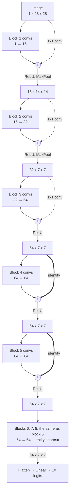
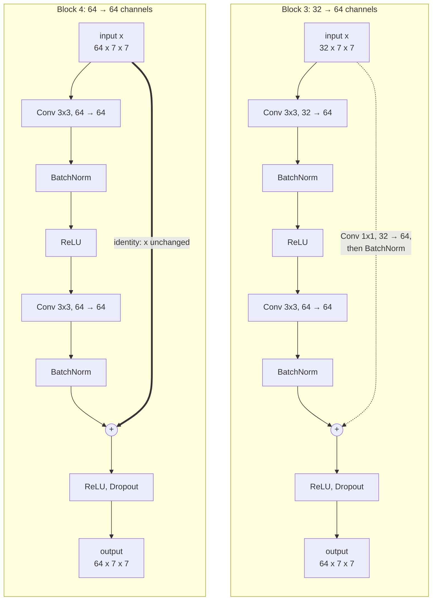
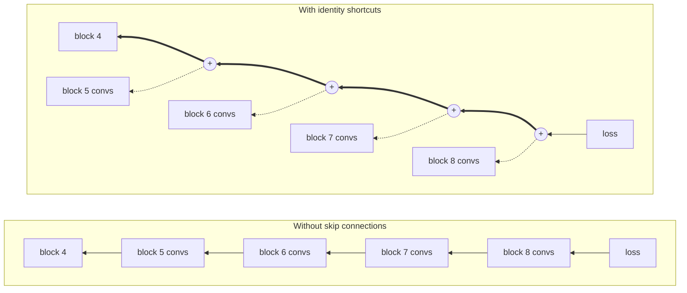

# HyperparameterSearchConvnets

[](https://colab.research.google.com/github/TXSTCODEPLAYGROUND/CodeCS4337Fall2026/blob/main/HyperparameterSearchConvnets/hyperparameter_search_convnets_notebook.ipynb)

[LitWBHSTrainingBasicNeuralNetwork](../LitWBHSTrainingBasicNeuralNetwork/)
for **convolutional networks**: a hyperparameter search with
[Optuna](https://optuna.org) that also searches the **architecture**. The
network is built from ResNet-like blocks, and each trial picks how many
blocks, how wide they are, how many convolutions each has, and whether they
use BatchNorm, skip connections, and dropout, together with the training
settings (optimizer, learning rate, regularization, scheduler, ...). The
best settings are saved as a normal config, which is then trained and tested
like any other.

The questions to answer: which of these architecture choices matter on
Fashion-MNIST, how deep and wide a network is worth it, and when do
BatchNorm and skip connections make deep networks trainable?

Read [LitWBHSTrainingBasicNeuralNetwork](../LitWBHSTrainingBasicNeuralNetwork/README.md)
first: the search, the Lightning code, and the W&B logging are the same;
only the network and its part of the search space differ. The convolution
basics are in [TrainingBasicConvnet](../TrainingBasicConvnet/README.md).
How to set up and run a project is in the [main README](../README.md).
Function and class details are in the
[API reference](https://txstcodeplayground.github.io/CodeCS4337Fall2026/HyperparameterSearchConvnets.html).

The easiest way to run everything is the project's own notebook,
[`hyperparameter_search_convnets_notebook.ipynb`](hyperparameter_search_convnets_notebook.ipynb)
(the **Open In Colab** button above opens it in Colab).
It has the same setup cells as the other projects' notebooks, then runs the search,
plots the results, shows the best network in [Netron](https://netron.app),
and trains the best config.

## The workflow

1. **Search** with a search config. Each trial trains one setting and is
   scored by its best validation accuracy:

   ```bash
   python -m HyperparameterSearchConvnets.search --config search01.json
   ```

2. **Read the results**: the printed best trial, `trials.csv`, and Optuna's
   plots (in the notebook). The notebook also draws the best trial's network
   in Netron: `utils.export_onnx` saves it as an ONNX file (keeping the
   BatchNorm layers), and Netron shows it layer by layer, with the skip
   connections as `Add` nodes.
3. **Train the best config**, which the search saved as
   `configs/search01_best.json`. This run tests the model once on the test
   set, the score to report:

   ```bash
   python -m HyperparameterSearchConvnets --config search01_best.json
   ```

The test set is never used during the search. Picking settings by their test
score would tune them to the test set, and the test score would no longer
show how well the model does on new data.

From Python or a notebook:

```python
from HyperparameterSearchConvnets import main
from HyperparameterSearchConvnets.search import search

study = search("search01.json", n_trials=30)
main("search01_best.json")
```

## The network builder

[`models/components/convnet.py`](models/components/convnet.py) builds the
network from the config's `"model"` section. A network is a stack of
**blocks** (`ConvBlock`), then one linear layer that predicts the class:

```
block = Conv 3x3 [-> BatchNorm] -> activation        (repeated convs_per_block times)
        [+ skip connection: add the block's input]
        [-> MaxPool 2x2]                              (first two blocks only)
        -> Dropout
```

| `"model"` key | What it sets |
| --- | --- |
| `channels` | Output channels of each block; its length is the number of blocks, e.g. `[32, 64]` |
| `convs_per_block` | 3x3 convolutions per block (padding 1, so the image size is kept) |
| `batch_norm` | `BatchNorm2d` after every convolution. The convolutions then have no bias, which BatchNorm would cancel |
| `skip_connections` | Add each block's input to the output of its last convolution, before the last activation, as in ResNet. When the channels change, a 1x1 convolution (with BatchNorm, if used) adapts the input |
| `activation` | `"relu"`, `"leaky_relu"`, `"gelu"`, or `"tanh"` |
| `dropout` | Dropout probability at the end of every block |

- **Image size.** The first two blocks end with 2x2 max pooling, so the
  28x28 images become 14x14, then 7x7; later blocks keep 7x7. The last
  block's feature maps are flattened into the linear layer.
- **Channels, as in ResNet.** The search does not pick every block's
  channels separately: it picks the first block's (`first_channels`: 16, 32,
  64, 128, or 256) and doubles them each time the image is halved, up to
  `max_channels` (256). `first_channels = 32` with 4 blocks gives
  `[32, 64, 128, 128]`; with 256, every block has 256. This is
  `block_channels()` in the same file. In your own configs, `channels` can
  be any list.
- **Why skip connections.** A skip connection lets a block learn only a
  correction to its input, and gradients flow back through the addition
  unchanged. Without it (and without BatchNorm), deep stacks of convolutions
  are hard to train: the trials with 8 blocks show it.

[`configs/config01.json`](configs/config01.json), the base config, has none
of these extras: two blocks, `[32, 64]`, one convolution each, no BatchNorm,
no skip connections, no dropout, then the prediction layer (50,186
parameters). It is the starting point of the search and the baseline to
beat. The largest network the search can build (8 blocks of 256 channels, 3
convolutions each) has about 13.7 million.

### Example: a deep network a trial could pick

Suppose a trial picks `num_blocks = 8`, `first_channels = 16`,
`convs_per_block = 2`, `batch_norm = true`, and `skip_connections = true`.
`block_channels(16, 8)` gives `[16, 32, 64, 64, 64, 64, 64, 64]`, and the
network is:



- **Blocks 1 to 3** (dotted shortcuts) change the number of channels, so the
  block's input goes through a 1x1 convolution before it can be added.
- **Blocks 4 to 8** (thick shortcuts) keep 64 channels, so the input is added
  unchanged (`nn.Identity()`): no weights, no computation.
- Only blocks 1 and 2 halve the image; the pooling comes after the addition,
  so a shortcut never has to change the image size.

Inside a block, the first convolution changes the channels and the others
keep them. Block 3 needs a 1x1 convolution on its shortcut; block 4 does not:



**Why the identity shortcuts matter.** During training, the gradient of the
loss flows backward through the network. Without skip connections it has to
pass through every convolution, and each one multiplies it by its weights, so
by the early blocks it is often tiny and they barely learn. With identity
shortcuts it also takes a direct path from one `+` to the next:



The thick path has nothing in it, so block 4 receives the loss's gradient
directly, while each block's convolutions (dotted) still get their share. This
is what lets deep networks train, and why a block that is not useful can
learn to output about zero and simply pass its input on. A small network like
the base config barely needs it: its gradient path is short. Compare trials
with many blocks, with and without `skip_connections`, to see the difference.

## What changes from LitWBHSTrainingBasicNeuralNetwork

| | LitWBHSTrainingBasicNeuralNetwork | This project |
| --- | --- | --- |
| Network | `MLP`: `"hidden_sizes"`, `"activation"`, `"dropout"` | `ConvNet`: the block settings above ([`models/components/convnet.py`](models/components/convnet.py)) |
| LightningModule | `LitMLP` | `LitConvNet` ([`models/lit_convnet.py`](models/lit_convnet.py)): the same code; the L1 penalty skips BatchNorm's parameters |
| Searched network settings | `n_layers`, `units`, `activation`, `dropout` | `num_blocks`, `first_channels`, `convs_per_block`, `batch_norm`, `skip_connections`, `activation`, `dropout` |
| `train_fraction` of the search | 1.0 | 0.25: ConvNet trials are slower |
| `runs_summary.csv` | `hidden_sizes` | `channels`, `convs_per_block`, `batch_norm`, `skip_connections` |

Everything else (optimizers, L1/L2, schedulers, early stopping, pruning, the
W&B logging, `load_model`, resuming) works as in
LitWBHSTrainingBasicNeuralNetwork.

## The search config

[`configs/search01.json`](configs/search01.json) has three parts:

- `"base_config"`: the training config every trial starts from. Everything not
  searched (seed, validation split, W&B project) comes from it.
- `"study"`: `n_trials`; `timeout_minutes` (stop starting trials after this
  time, `null` for no limit); the sampler's `seed`; `train_fraction` (the
  fraction of the training data each trial uses, see
  [below](#how-long-a-search-takes)); the pruner settings (below); and
  `log_trials_to_wandb` (`false`, see
  [below](#comparing-the-trials-in-wb)).
- `"search_space"`: what each trial may pick.

| Key | Searched as | Notes |
| --- | --- | --- |
| `num_blocks` | Integer range | Number of blocks, 2 to 8 |
| `first_channels` | Choices | Channels of the first block; the others follow (see [above](#the-network-builder)) |
| `max_channels` | Not searched | A single number: the upper limit of the channels |
| `convs_per_block` | Integer range | 1 to 3 |
| `batch_norm` | Choices | `[true, false]` |
| `skip_connections` | Choices | `[true, false]` |
| `activation` | Choices | |
| `dropout` | Range | At the end of every block |
| `batch_size` | Choices | |
| `epochs` | Integer range | Maximum epochs; early stopping may end sooner |
| `optimizer` | Choices | |
| `lr` | Range, log scale | Each power of ten is equally likely |
| `momentum` | Range | Only for SGD and RMSprop |
| `regularization` | Choices | `"none"`, `"l1"`, `"l2"`, or `"l1_l2"` |
| `l1`, `l2` | Range, log scale | Only when `regularization` uses them |
| `scheduler` | Choices | `"none"`, `"step"`, `"cosine"`, or `"plateau"` |
| `step_size` | Integer range | Only for `"step"` |
| `gamma` | Range | Only for `"step"` and `"plateau"` |
| `early_stopping` | Choices | `[true, false]` |
| `patience` | Integer range | Only with early stopping |

The "only for" rows are a key Optuna feature: the search space is defined by
running Python code, `suggest_config()` in [`search.py`](search.py), so an
`if` decides what each trial samples. A trial using Adam has no momentum at
all, rather than a momentum value that is silently ignored.

To fix a hyperparameter instead of searching it, give one choice
(`"optimizer": ["adam"]`) or equal ends (`"epochs": [10, 10]`). To try a
different search, copy `search01.json` to `search02.json`, edit it, and pass
`--config search02.json`; each search config gets its own study and results.

## How Optuna searches

- **Trials and the objective.** A trial is one training run with one setting.
  Optuna calls the objective (`_Objective` in `search.py`) once per trial; it
  builds the config with `suggest_config()`, trains with the same `build()`
  as `main()`, and returns the best validation accuracy.
- **The TPE sampler** (Tree-structured Parzen Estimator) picks the settings.
  The first trials are random; after that it compares the settings of the
  good trials with those of the bad ones and samples more often where the
  good ones are. It usually finds good settings in far fewer trials than a
  grid or random search.
- **The median pruner** stops a trial when its validation accuracy after an
  epoch is below the median of the earlier trials at the same epoch. The
  callback [`OptunaPruning`](callbacks/optuna_pruning.py) reports the
  accuracy after every epoch and stops training when the pruner says so; the
  search then marks the trial as pruned. `pruner_startup_trials` trials always run to the end first, so
  there is something to compare with, and no trial is pruned during its first
  `pruner_warmup_epochs` epochs.
- **Seeds.** Every trial uses the base config's seed, so a trial and its
  saved config train identically: with `train_fraction` 1.0, training
  `search01_best.json` reproduces the best trial's validation accuracy.

## Results

Search results go to
`<OUTPUT_DIR>/HyperparameterSearchConvnets/search01/`:

| File | What it is |
| --- | --- |
| `study.db` | The Optuna study (an SQLite database), saved after every trial. Running the same search again **adds** trials to it, so an interrupted search continues where it stopped. To start over, delete the folder or use a new search config name. |
| `trials.csv` | One row per trial: state (`COMPLETE` or `PRUNED`), `val_acc`, epochs run, number of parameters, duration, and every sampled setting. |
| `best_config.json` | The training config of the best trial, with a `found_by` entry naming the trial. Also saved as `configs/search01_best.json`. |
| `wandb/` | Only with `"log_trials_to_wandb": true`: the trials' local W&B files (offline runs to `wandb sync` if there was no key). |

`search("search01.json", n_trials=0)` (or `--n-trials 0`) runs no new trial
and rewrites these files from the saved study. In Colab this brings back
`configs/search01_best.json` after a runtime reset deleted the repo folder.

Training the best config gives a normal run folder,
`<OUTPUT_DIR>/HyperparameterSearchConvnets/search01_best/<timestamp>/`,
as in [LitWBTrainingBasicConvnet](../LitWBTrainingBasicConvnet/README.md#run-folder).
`runs_summary.csv` also records the block settings (`channels`,
`convs_per_block`, `batch_norm`, `skip_connections`), the optimizer,
regularization, scheduler, early stopping, and the number of epochs actually
run.
To load the trained model back, with the network the search picked:

```python
from HyperparameterSearchConvnets import load_model

model = load_model("search01_best")   # newest run of search01_best, best checkpoint
```

The trials themselves save no checkpoints, only their scores.

To train the best config further, resume its run (see
[Continuing training](../LitTrainingBasicConvnet/README.md#continuing-training)):

```python
main("search01_best.json", resume_from="search01_best")   # "epochs" more epochs
```

The optimizer, scheduler, and early-stopping state continue from the run's
`last.ckpt`. A cosine schedule had already reached a learning rate of 0 at the
end of the earlier run, so on resuming its curve is stretched over all epochs
(earlier plus new), and training continues from the learning rate the
stretched curve has at that epoch.

## Comparing the trials in W&B

By default the trials are **not** logged to W&B: starting and uploading one
W&B run per trial adds a few seconds to every trial and fills the project
with dozens of runs, while Optuna's plots and `trials.csv` already compare
them. Only training the best config (step 3) is logged, like any other run.

To log the trials too, set `"log_trials_to_wandb": true` in the search
config's `"study"`. Every trial is then a W&B run in the project
`HyperparameterSearchConvnets`, in the group `search01`, with job type
`search`. Its config holds the sampled settings, and its summary
`best_val_acc` and `state` (`complete` or `pruned`).

1. In the **Runs** table, filter or group by `group`, show the settings you
   care about, and sort by `best_val_acc`.
2. Add a **Parallel coordinates** panel with the searched settings (e.g.
   `model.channels`, `model.batch_norm`, `model.skip_connections`,
   `training.lr`, `num_params`) and
   `best_val_acc` as the last axis. Each trial is one line; highlighting the
   high end of `best_val_acc` shows which settings the best trials share.
3. Add a **Parameter importance** panel for `best_val_acc`.
4. The `val_acc` chart overlays all trials (pruned ones stop early), and the
   `lr-...` chart shows what each scheduler did to the learning rate.

The general W&B setup (keys, offline mode, `wandb sync`) is explained in the
[LitWBTrainingBasicConvnet README](../LitWBTrainingBasicConvnet/README.md).

## How long a search takes

ConvNets take longer than fully connected networks, and the search also
tries deep, wide ones. On a GPU, with `search01.json`'s `train_fraction` of
0.25, a trial takes from a few seconds (a small network, pruned after two
epochs) to several minutes (8 blocks of 256 channels for 15 epochs), so the
30 trials take roughly half an hour to a few hours. To check that everything works
first, run a few trials: `--n-trials 3`. Fewer epochs per trial make the
search faster, but favor settings that learn quickly over settings that end
best.

**Training on part of the data.** Loading images is often the bottleneck,
especially in Colab, which has only 2 CPU cores for it (`"num_workers":
"auto"` uses up to 8 cores elsewhere). To make every trial faster, train each
trial on a fraction of the 54,000 training images:

```bash
python -m HyperparameterSearchConvnets.search --config search01.json --train-fraction 0.25
```

or `search("search01.json", train_fraction=0.25)`, or `"train_fraction"` in
the search config's `"study"`. The subset is stratified: every class keeps
the same fraction of its images (e.g. about 1,350 of each class at 0.25), so
no class is over- or under-represented by chance. It is drawn with the seed,
so every trial trains on the same images.

- The validation set stays complete (6,000 images), so trials are still
  ranked reliably. Shrinking it too would make the scores noisy: at about 88%
  accuracy, 6,000 images give a score accurate to about ±0.4%, 1,200 only to
  about ±0.9%, as large as the gaps between good trials.
- `search01.json` uses 0.25 by default, because ConvNet trials are slow.
- The saved best config keeps the base config's `"train_fraction"` (1.0), so
  section 3 of the workflow still trains the final model on all the data.
- Settings that depend on the amount of data may not transfer exactly: with
  less data, a model overfits sooner, so the search may favor more dropout or
  L1/L2, and an epoch has fewer steps. Use the fraction to explore quickly,
  and `1.0` for a final, narrower search when you have the time.
- Keep the same fraction for all trials of a study; to change it, use a new
  search config name (e.g. `search02.json`), since scores from different
  fractions are not comparable.

`"train_fraction"` also works in a training config's `"data"` section, e.g.
for a quick test of `main()`.

## Things to try

- **BatchNorm and skip connections:** in the slice plot, compare the trials
  with and without each. Then search with `"num_blocks": [8, 8]` only: how
  do deep networks do without them?
- **Depth vs. width:** fix everything but `num_blocks` and `first_channels`,
  and look at the contour plot. Compare `num_params` in `trials.csv`: does
  the biggest network win?
- After a first search, read the importances: fix the unimportant settings
  and search the important ones in a narrower range (`search02.json`).
- Compare the best config's test accuracy with `config01.json`'s, and with
  [LitWBTrainingBasicConvnet](../LitWBTrainingBasicConvnet/) (about 92%).
  How much did the search gain?
- Search only the learning rate and the optimizer, with everything else
  fixed: how much of the gain comes from those two?
- Extend the builder: e.g. a `"kernel_size"` for the convolutions, or global
  average pooling instead of flattening before the linear layer. Add the key
  to `ConvNet`, to `config01.json`, and to `suggest_config()`.
- Add a training hyperparameter: e.g. a `"label_smoothing"` value for the
  cross-entropy loss. Add it to the config, use it in `LitConvNet`, and sample it
  in `suggest_config()`.
- Replace `TPESampler` with `optuna.samplers.RandomSampler` in `search.py`
  and compare how fast the best score rises.
