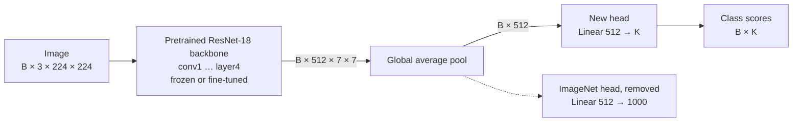
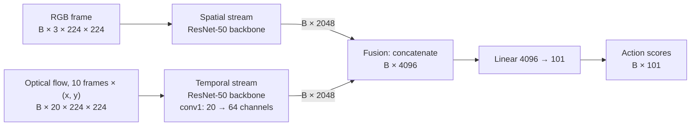
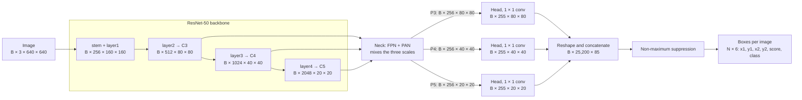
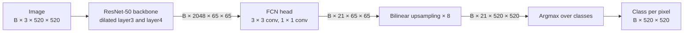
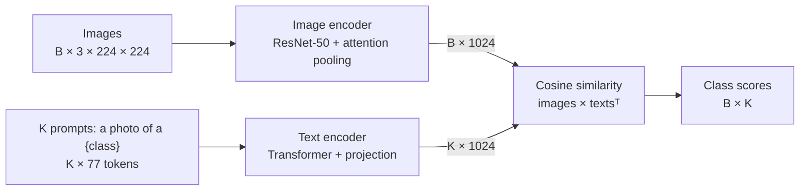

# ResNetWalkThrough

A tour of **ResNet** ([He et al., 2015](https://arxiv.org/abs/1512.03385)),
the network that made very deep ConvNets trainable with skip connections.
Nothing is trained: the notebook takes ResNets already trained on ImageNet
from `torchvision` and looks at them from every side.

Unlike the other projects, this one is **only a notebook**,
[`ResNetWalkThrough.ipynb`](ResNetWalkThrough.ipynb): no package, no
configs, no `python -m`. The ResNet-like blocks you trained yourself are in
[HyperparameterSearchConvnets](../HyperparameterSearchConvnets/README.md).

## What the notebook covers

1. **Setup**: one cell, nothing to clone in Colab.
2. **Example data**: [Imagenette](https://github.com/fastai/imagenette),
   10 easy ImageNet classes (about 95 MB, downloaded to `data/`).
3. **A pretrained ResNet-18** and its top-5 predictions on one image per class.
4. **The architecture**: the stem, the four stages, the blocks, and the head
   with [torchinfo](https://github.com/TylerYep/torchinfo), the first block of
   a stage (with and without a `downsample` shortcut), and the whole graph
   drawn with [torchview](https://github.com/mert-kurttutan/torchview).
5. **The graph in [Netron](https://netron.app)**: the network exported to
   ONNX (in `runs/ResNetWalkThrough/`) and opened in the browser.
6. **Inside the network** with [Captum](https://captum.ai):
   - the activations of every layer (the 8 most active channels per layer);
   - one residual block step by step: input, main path, shortcut, output;
   - **Grad-CAM** heatmaps: which regions of the image made the network
     choose the predicted class, and the true class.
7. **ResNet variants**: ResNet-18 to ResNet-152, ResNeXt, and Wide ResNet
   compared (blocks, depth, parameters, ImageNet accuracy), a bottleneck
   block, and ResNet-18 vs. ResNet-50 on 500 Imagenette images.
8. **ResNet as a backbone**: transfer learning set up in three lines (freeze
   the backbone, replace the head with one for Imagenette's 10 classes, no
   training), and the backbone used as a feature extractor (the 512-number
   embedding and the multi-scale maps `C3`, `C4`, `C5`).

## Grad-CAM in one line

$$
\text{Grad-CAM} = \mathrm{ReLU}\left( \sum_{\text{channels}} \text{mean}(\text{gradient}) \times \text{activation} \right)
$$

The activation is the output of one layer (`layer4`: 512 maps of 7 × 7); the
gradient is the derivative of the class score with respect to that output,
so it has the same shape. Its average per channel says how much the class
relies on that channel; the activation says where the channel fires in this
image. The weighted sum is upsampled to 224 × 224 and overlaid on the image.

## ResNet as a backbone

A ResNet trained on ImageNet is rarely used as is. Its last layer, `fc`, only
knows ImageNet's 1,000 classes, but everything before it, the **backbone**,
computes general visual features that other networks reuse. The diagrams
below show the data flow of five common uses, with the tensor shapes. The
ResNet is drawn as one box; its inside is what the notebook explores.

Notation: `B` is the batch size and `K` the number of classes of the new task.
Shapes are `B × channels × height × width`.

### 1. Transfer learning (image classification on new classes)

Section 8 of the notebook. The backbone is kept, the ImageNet head is
replaced by a new one, and only the new head is trained (feature extraction)
or the whole network with a small learning rate (fine-tuning).

### 2. Two-stream network (action recognition from video)

Two ResNets look at the same moment of a video
([Simonyan and Zisserman, 2014](https://arxiv.org/abs/1406.2199)): the
**spatial** stream sees one RGB frame (what objects and scene), the
**temporal** stream sees the optical flow of the next 10 frames (how things
move; x and y displacement per frame, so 20 channels). The temporal ResNet's
first convolution is changed to take 20 channels; its weights start from the
ImageNet filters averaged over RGB and copied 20 times. Here the two
embeddings are fused by concatenation, for UCF101's 101 actions.

A simpler fusion, used in the original paper, gives each stream its own head
(`B × 101` each) and averages the two softmax outputs.

### 3. Object detection (YOLO-style)

A detector needs to know **where** objects are, so it takes the feature maps
of three stages instead of the pooled embedding: `C3` (1/8 of the image
size, fine details, small objects), `C4` (1/16), and `C5` (1/32, large
objects). A **neck** (FPN + PAN) mixes the three scales, and a **head** per
scale predicts, for each cell and each of 3 anchor boxes, a box (x, y, w, h),
an objectness score, and the scores of the C = 80 COCO classes:
3 × (5 + 80) = 255 channels. YOLOv3 uses its own Darknet backbone; a
ResNet-50 is a common replacement.

25,200 = 3 anchors × (80² + 40² + 20²) cells: every candidate box before
non-maximum suppression removes the overlapping ones.

### 4. Semantic segmentation (FCN)

Segmentation predicts a class for **every pixel**. torchvision's
`fcn_resnet50` replaces the stride of `layer3` and `layer4` by dilated
convolutions, so the maps stop shrinking at 1/8 of the image size; a small
head turns them into one score map per class, upsampled back to the image
size.

### 5. Image and text (CLIP, multimodal)

[CLIP](https://arxiv.org/abs/2103.00020) trains a ResNet-50 image encoder
and a Transformer text encoder so that matching images and captions get
close embeddings. Afterwards it classifies images **without training on the
new classes** (zero-shot): each class name becomes a sentence, and the
image's class is the sentence with the most similar embedding.

### Summary

| Application | What is taken from the ResNet | What is added | Output |
| --- | --- | --- | --- |
| Transfer learning | embedding, `B × 512` | `Linear(512, K)` | `B × K` |
| Two-stream action recognition | two embeddings, `B × 2048` each | concatenation, `Linear(4096, 101)` | `B × 101` |
| YOLO-style detection | `C3`, `C4`, `C5` maps | neck, three 1 × 1 conv heads | `B × 25,200 × 85`, then `N × 6` boxes |
| FCN segmentation | dilated `layer4` map, `B × 2048 × 65 × 65` | conv head, upsampling | `B × 21 × 520 × 520` |
| CLIP | embedding, `B × 1024` | text encoder, cosine similarity | `B × K` |

The diagrams are written in [Mermaid](https://mermaid.js.org), which GitHub
renders directly in this README. In Cursor or VS Code, the Markdown preview
needs a Mermaid extension (e.g. *Markdown Preview Mermaid Support*).

## Running it

**Colab:** click the badge above and run the cells from top to bottom. A GPU
runtime is faster but not required.

**Locally:** install the repo's requirements (see the
[main README](../README.md#running-locally)), then open the notebook from this
folder with the repo's `.venv` as the kernel. Two extras:

- The torchview graph needs the **Graphviz** program, which pip cannot
  install: `sudo apt install graphviz` (Linux), `brew install graphviz`
  (macOS), or the installer from [graphviz.org](https://graphviz.org/download/)
  (Windows). Colab already has it.
- Netron serves the graph on `localhost:8081`. If you run Cursor or VS Code on
  a remote machine over SSH, forward that port (Ports panel) to open it in
  your browser.

The first run downloads Imagenette and the pretrained weights (ResNet-18:
45 MB, ResNet-50: 98 MB, cached by PyTorch in `~/.cache/torch`).
